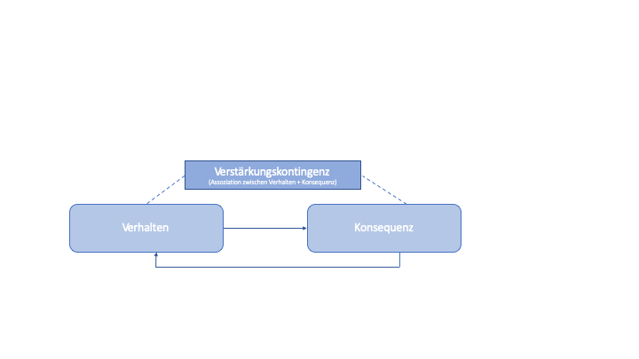
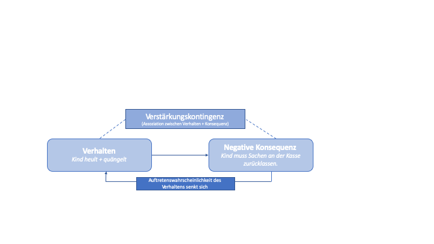
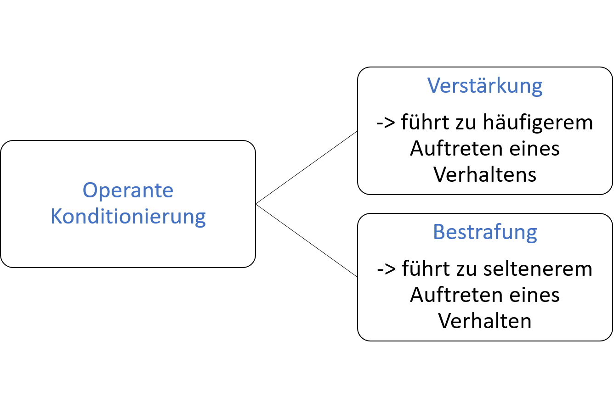

## Was ist operantes Konditionieren?

Störungen zu vermeiden oder einzudämmen hat viel mit dem gezielten Aufbau von erwünschtem und dem Abbau unerwünschten Schüler*Innenverhalten zu tun. Der Aufbau bzw. Abbau von Verhaltens wird in den Prinzipien Operanten Konditionierens systematisiert. 

*Wie funktioniert operante Konditionierung?*

> Operantes Konditionieren beschreibt das Lernen des Zusammenhangs zwischen beobachtbarem Verhalten eines Organismus und der darauffolgenden Konsequenz: 

 •	Organismen lernen, dass auf ein bestimmtes Verhalten ein bestimmtes positives oder negatives Ereignis folgt (Konsequenz). 

 •	Verhalten wird wegen der darauffolgenden positiven oder negativen Konsequenz gezeigt bzw. nicht gezeigt. 

 •	So kommt es zum Aufbau einer Assoziation zwischen Verhalten und Konsequenz.

*Stellen Sie sich beispielsweise vor, ein Kind steht an der Kasse eines Supermarktes und macht die Erfahrung, dass lautes Quängeln und Heulen dazu führt, dass die Mutter die gewünschten Süßigkeiten kauft, die sie zuvor abgelehnt hat.*

 - Das Kind lernt, dass auf ein bestimmtes Verhalten (quängeln und heulen) eine positive Konsequenz folgt: die Mutter kauft die gewünschten Süßigkeiten. Man könnte auch sagen, das Kind wird für sein Verhalten „belohnt“. 
  
 - In der Folge zeigt das Kind dieses Verhalten häufiger (quängelt und heult jedes Mal an der Kasse). 
  
 - Das Kind assoziert aufgrund dieser Erfahrung die Situation des Quängelns und Heulens an der Kasse mit dem Kauf von Süßigkeiten. 

*Stellen Sie nun vor, die Mutter würde dem quängelnden und heulenden Kind erwidern, dass sie aufgrund seines trotzigen Verhaltens nun auch den Lieblingsjoghurt, den sich das Kind im Laufe des Einkaufs ausgesucht hat, an der Kasse zurücklässt.*

- Das Kind lernt, dass auf ein bestimmtes Verhalten (quängeln und heulen) eine negative Konsequenz folgt: der Lieblingsjoghurt wird an der Kasse zurückgelassen. Man könnte auch sagen, das Kind wird für sein Verhalten „bestraft“. 
- In der Folge zeigt das Kind dieses Verhalten seltener.
- Das Kind assoziert aufgrund dieser Erfahrung die Situation des Quängeln und Heulens an der Kasse mit dem Zurücklassen ausgesuchter Sachen. 

*Was bedeutet das für den gezielten Aufbau und Abbau Verhalten?*

Im vorangegangenen Beispiel haben sie nun bereits zwei unterschiedliche Prinzipien operanten Konditionierens kennengelernt: 

> •	Wird die Konsequenz, die auf das Verhalten folgt, als positiv empfunden, spricht man Verstärkungsprozessen. Verstärkungsprozesse führen dazu, dass Verhalten aufgebaut wird, also häufiger gezeigt wird.

> •	Wird die Konsequenz, die auf das Verhalten folgt, als negativ empfunden, spricht man von Bestrafungsprozessen. Bestrafungsprozesse führen dazu, dass ein Verhalten seltener gezeigt wird. 

Beide Prozesse werden Ihnen im Folgenden näher erläutert.

