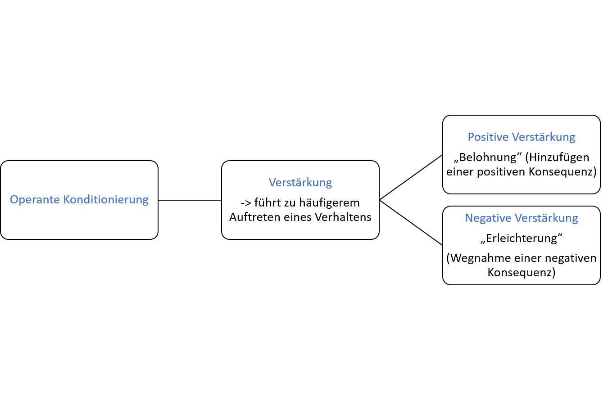
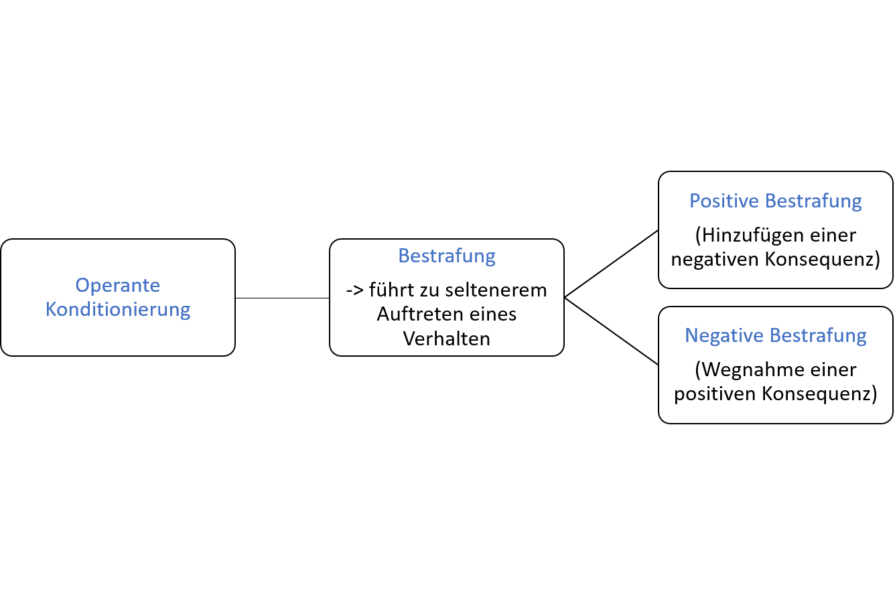
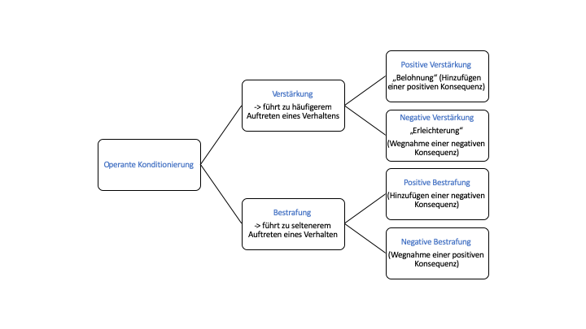

## Prinzipien Operanten Konditionierens

***Verstärkung: Aufbau von Verhalten***

Bei Verstärkungsprozessen wird das Ereignis, das auf ein Verhalten folgt als angenehm empfunden. Mit Verstärkung lässt sich daher eine Erhöhung der Auftretenswahrscheinlichkeit eines Verhaltens bewirken. Dies kann auf zweierlei Arten geschehen: durch Darbietung eines angenehmen Reizes (**positive Verstärkung**) oder durch Entzug eines unangenehmen Reizes (**negative Verstärkung**). 

 
> * Positive Verstärkung (+): Es wird ein angenehmer Reiz hinzugefügt.
> * Negative Verstärkung (-): Es wird ein unangenehmer Reiz entzogen. 

In beiden Fällen führt Verstärkung dazu, dass ein Verhalten häufiger auftritt. 

Mit Blick auf unser Kind an der Supermarktkasse bedeutet das:

*- kauft die Mutter in Folge des Quängelns die gewünschten Süßigkeiten, wird für das Kind ein angenehmer Reiz hinzugefügt*: **positive Verstärkung**

*- erlaubt die Mutter zur Besänftigung des Kindes, dass es stattdessen während des Bezahlvorgangs bereits aus der Gebäcktüte ein Brötchen essen darf, was sonst verboten ist, wird für das Kind eine unangenehmer Reiz (Verbot) entzogen*: **negative Verstärkung** 

***Bestrafung: Abbau von Verhalten***

Bei Bestrafungsprozessen wird das Ereignis, was auf ein Verhalten folgt als unangenehm empfunden. Durch Bestrafung lässt sich eine Reduktion der Auftretenswahrscheinlichkeit eines Verhaltens bewirken. Dies kann ebenfalls auf zweierlei Arten geschehen: durch Darbietung eines unangenehmen Reizes (**positive Bestrafung**) oder durch Entzug eines angenehmen Reizes (**negative Bestrafung**). 

> * Positive Bestrafung (+): Es wird ein unangenehmer Reiz hinzugefügt.
> * Negative Bestrafung (-): Es wird ein angenehmer Reiz entzogen.

In beiden Fällen führt Bestrafung dazu, dass ein Verhalten seltener auftritt. 

Mit Blick auf unser Kind an der Supermarktkasse bedeutet das:

*- schimpft die Mutter in Folge des Quängelns mit dem Kind, wird für das Kind ein unangenehmer Reiz hinzugefügt*: **positive Bestrafung**

*- lässt die Mutter in Folge des Quängelns den Lieblingsjoghurt des Kindes an der Kasse zurück, wird für das Kind ein angenehmer Reiz entzogen*: **negative Bestrafung**
 
Betrachtet man nun alle Verstärkungs- und Bestrafungsprozesse im Überblick, ergeben sich vier mögliche Konditionierungsmaßnahmen zum gezielten Aufbau bzw. Abbau von Verhalten:

*Klicken Sie auf den Pfeil oben links und kehren Sie ins Hauptmenü zurück.* Arbeiten Sie anschließend **im Begleitheft** weiter!