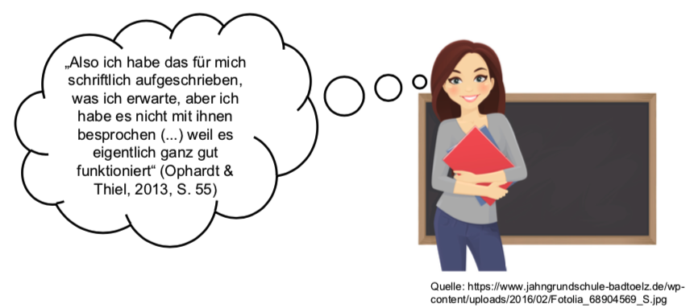

## Empfehlungen für die Einführung von Regeln 

*Der richtige Anfang*

* Regeln und Prozeduren am Beginn eines Schuljahres einführen, nicht erst wenn es zu Störungen kommt!
* Neue Regeln können auch während des Schuljahres hinzugefügt werden, um eine akute problematische Situation in den Griff zu bekommen 
* Regeln nicht nur verkünden, sondern Schüler*innen in den Prozess miteinbeziehen

*"Regeln" für Regeln und Prozeduren*

* So wenig wie möglich (so viel wie nötig): *z.B. nur 5 goldene Regeln formulieren statt einer unübersichtlichen Liste mit 20 Regeln, nur wenig Anlässe für Disziplinierung geben.*
* So einsichtig wie möglich: *gut sichtbar im Klassenraum plazieren, Lernende in Erarbeitungsprozess einbeziehen.* 
* So positiv wie möglich (Wie soll ich mich verhalten? vs. Wie soll ich mich nicht verhalten?): *z.B. besser "Ich komme pünktlich zum Klingeln" statt "Nicht zu spät kommen"*
* So konkret und verhaltensnah wie möglich
* So ernst nehmen wie möglich: *z.B. Reinrufen nicht bei guten inhaltlichen Beiträgen durchgehen lassen, weil es den Unterricht in dem Fall voranbringt*
* Anreize für die Einhaltung und Sanktionen für Verstöße klarstellen: *z.B. Einführung eines Punktesystems: bei konstruktivem Arbeitsverhalten werden Punkt hinzugefügt, bei destruktivem Arbeitsverhalten werden Punkte entzogen. Punkte können von der Klasse gegen attraktive gemeinsame Aktivitäten eingelöst werden, beispielsweise "Mathe-Fußball".*

*Klicken Sie auf den Pfeil oben links und kehren Sie ins Hauptmenü zurück. Bearbeiten Sie als nächstes das Kapitel 6 Fazit.* 