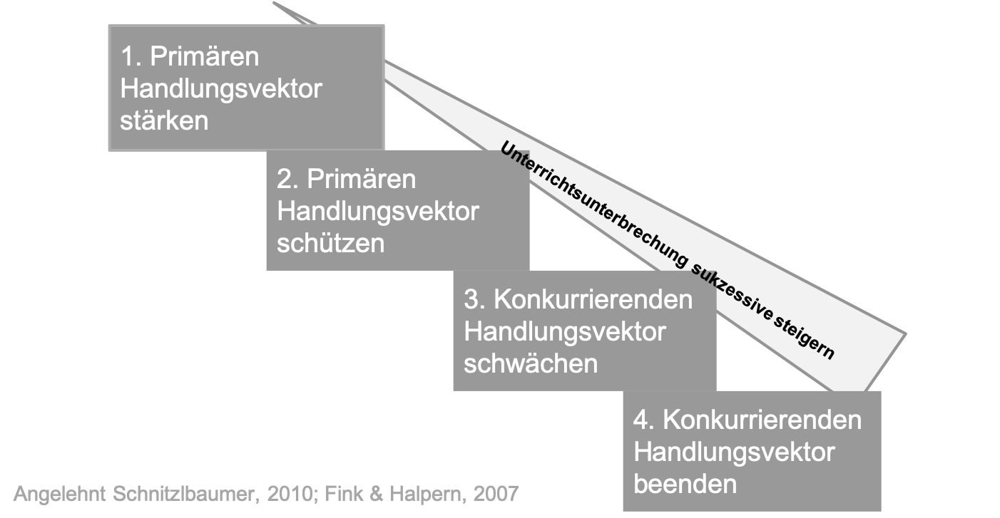

## Fazit

Sie haben nun im Laufe der digitalen Lerneinheit verschiedene Maßnahmen und Strategien kennengelernt, um Störungen zum einen präventiv entgegenzutreten und zum anderen in akuten Situationen zu intervenieren. 

> Generell gilt:  Maßnahmen zur Störungsprävention und – intervention sollten sukzessive gesteigert werden mit dem Ziel möglichst wenig Unterbrechung zu verursachen und schnell zum Unterricht zurückzukehren!

Das bedeutet für Sie im Unterricht: 

•	**Primären Handlungsvektor stärken**: Wenn möglich, einen Vorfall im akuten Moment ganz übergehen um den Unterrichtsfluss aufrecht zu erhalten. Positives Verhalten durch Lob und Aufmerksamkeit verstärken! 

•	**Primären Handlungsvektor schützen**: Zunächst nonverbale Signale ohne Unterrichtsunterbrechung senden (z.B. Blickkontakt aufnehmen, räumlich annähern).

•	**Konkurrierenden Handlungsvektor schwächen**: Wenn die Störung mehr Eingreifen erforderlich macht, minimale beiläufige Intervention (z.B. kurze Aufforderung/ Ermahnung, Nennung des Namen, Sprechpause einlegen) nutzen. 

•	**Konkurrierenden Handlungsvektor beenden**: Nur wenn die Störung gravierende Auswirkungen auf den Unterrichtsverlauf hat: Störungen sanktionieren (z.B. Sitzordnung ändern, Nacharbeit/Zusatzarbeit). 

**Aufgabe: Ordnen Sie die Präventions- und Interventionsmaßnahmen der Lehkraft aufsteigend nach dem Umfang der Unterrichtsunterbrechung!**

<orderquestion id="1"></orderquestion>

*Geschafft! Sie haben sich nun alle Inhalte erarbeitet. Wir hoffen, Sie können viele Anregungen für Ihre Unterrichtspraxis mitnehmen!*